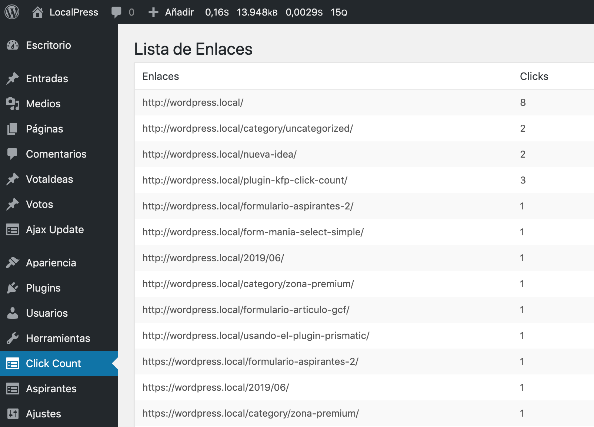

# kfp-clickcount

Cuenta los clics que se producen en una web, de momento todos, pronto selectivamente.

Al instalar el plugin se crea una tabla para almacenar los enlaces que se han ido pulsando y las veces que se ha pulsado cada uno, así como la fecha en que se pulsó el enlace por primera y última vez.

A partir de este momento cada vez que se pulse un enlace en el fronted este se agregará a la tabla si no existe o se incrementará el contador si el enlace ya estaba registrado.

El plugin crea un nuevo menú en el escritorio que muestra la lista de enlaces con sus contadores. 

[Desarrollo de este plugin para contar clics explicado paso a paso en KungFuPress](https://kungfupress.com/construye-un-plugin-para-contar-los-clics-a-los-enlaces-de-tu-web/)

## Tareas pendientes 

- [ ] Aunque en esta primera versión la implementación es muy básica sería sencillo modificar el plugin para que registrara enlaces marcados con una **clase** determinada, distinguir enlaces con la misma URL pero con distinto **id**, etc.
- [ ] Traducir todas las cadenas al inglés
- [ ] Implementar DataTable en la tabla pública para poder ordenar por las distintas columnas, paginar los resultados y hacer búsquedas.
- [x] Implementar shortcode para mostrar en el frontend la tabla de enlaces y contadores.

## Changelog

- 2019-11-05 Shortocode para mostrar la tabla de enlaces y clics en el frontend.
- 2019-11-04 Mejoras de estilo y organización del plugin.
- 2019-10-29 Los enlaces que aparecen en el panel de administración "funcionan".
- 2019-10-25 Aplica estándares WordPress y añade fecha último clic.
